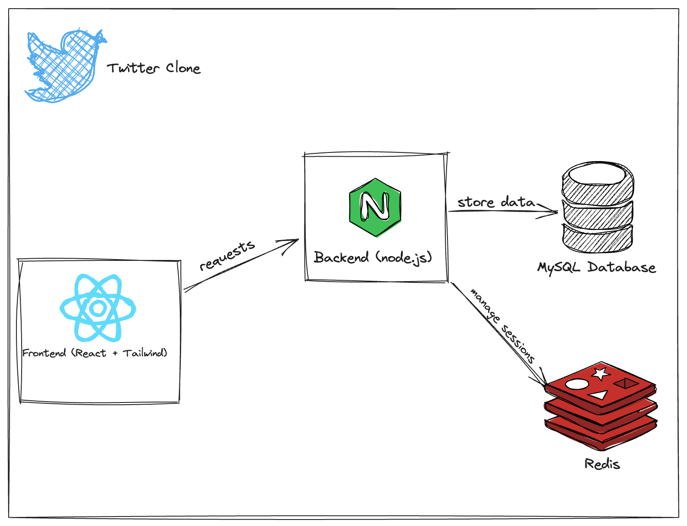

# Twitter

This repository serves as educational material to teach the fundamentals of Frontend and Backend engineering. The idea here is that both of those components can be developed in "isolation".

For instance, as a Frontend developer if we assume that the backend already has all the APIs we need for consumption and manipulation, we can run those backend components as containers and just trust the APIs.

As a Backend developer, we can conform to a strict API definition, most likely using OpenAPI or something similar, and work to achieve the desired result that the API is requesting.

## Architecture

The above diagram (subject to change) shows the basic architecture of the application.

## Components
